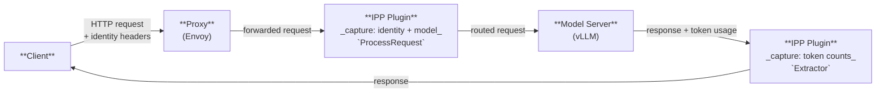

# IPP Request Attribution: Capturing Requestor, Workload & Tenant

Author(s): @simanadler

## Proposal Status

***Proposed***

## Motivation

[Phase 1 of inference cost tracking](https://github.com/opencost/opencost/blob/develop/docs/inference-cost-tracking.md) provided inference costs per model and per million tokens for the models, broken out by input and output token costs.  However, llm-d deployments need to answer additional questions the current vllm metrics do not support:

- *"What did tenant `acme-corp` spend on inference this month?"*
- *"Which workload (agent/pipeline) is driving token growth?"*
- *"Attribute this GPU bill back to the teams that consumed it."*

vLLM never sees HTTP identity headers and has no concept of tenant, workload, or requestor. The llm-d Router / Endpoint Picker (EPP) emits
per-model token-count metrics but carries no identity labels — it has no concept of tenant, workload, or requestor. IPP's existing `model-cost-extractor` produces a cost distribution *per model* based on static data from a config file. **None of these can attribute consumption to an identity.**


## Proposal

This document proposes an **IPP plugin based solution** to enable llm-d to generate **metrics about requestor, workload, and tenant
identity for inference requests** — the "who / what / which-tenant" needed for cost attribution,
chargeback/showback, observability, governance, and audit.

> **Scope: online / interactive inference.** This proposal targets the **synchronous request path**. Asynchronous batch jobs submitted
via [`llm-d-batch-gateway`](https://github.com/llm-d/llm-d-batch-gateway) are out of the scope of this document.

See the companion [OpenCost proposal](https://github.com/simanadler/opencost/blob/bd9be47efea6ec850d0b37052c9d087c4621ad83/docs/inference-cost-new-dimensions-proposal.md) describing the changes required in OpenCost to leverage the new metrics and provide tenant, workload and requestor level inference costs.

### Why IPP is the correct home

1. **It is the only component that correlates both signals.** IPP sees *who* (request headers) and *how
   many tokens* (response body) in a single request cycle, carried across request→response on
   [`CycleState`][cycle_state] and the [`ResponsePayload`][datasource_types] (which already includes
   `Duration` and `TTFT`). vLLM has tokens but no identity; the EPP emits token-count metrics but
   labels them only with model and scheduling (`fairness_id`) dimensions — identity headers are never
   written to any EPP log or metric; Envoy dynamic metadata has tokens but needs a separate mechanism
   to correlate identity headers to them. IPP already holds both and is the only place they can be
   joined.

2. **It already exists in the data plane.** This is not a new component — it is two plugins added to
   a framework built for exactly this ("any logic that benefits from reading or rewriting the body,
   headers, or trailers can be expressed as a plugin"). No new pod, no new proxy hop, no new failure
   domain, no second control plane.

3. **It respects the existing component boundaries.** IPP owns *identity + volume*, vLLM
   owns *model-level throughput*, OpenCost owns *cost monitoring*. 

### Other approaches considered
* [Existing attribution solutions](#appendix-a-background--the-attribution-landscape)
* [llm-d Endpoint Picker (EPP)](#appendix-b-why-epp-was-not-chosen)
* [Logs from existing llm-d components](#appendix-c-why-existing-llm-d-logs-are-insufficient)

## Design

### The five signal dimensions

The following are the new dimensions and their sources.

| Signal | Carrier | Field / Header | IPP access point |
|--------|---------|----------------|------------------|
| **Requestor** (who) | HTTP header | `x-user-id` (or JWT `sub`) | `request.Headers["x-user-id"]` in `ProcessRequest` |
| **Tenant** (which) | HTTP header | `x-tenant-id` | `request.Headers["x-tenant-id"]` in `ProcessRequest` |
| **Workload** (what) | HTTP header or body | `x-workload-id`, or OpenAI `user` body field | `request.Headers[...]` or `request.Body["user"]` |
| **Requested model** | JSON body | `model` | `request.Body["model"]` — captured *before* `model-selector` rewrites it |
| **Serving model** | JSON response body | `model` | `response.Body["model"]` — authoritative vLLM value; the OpenCost/vLLM join key |

> **Trust boundary (important):** header-supplied identity is only as trustworthy as whatever sets
> the headers. `x-tenant-id` / `x-user-id` / `x-workload-id` MUST be injected/validated at an
> authenticated boundary (auth proxy, gateway auth filter, or JWT verification) and MUST NOT be
> accepted verbatim from untrusted clients. This is the same caveat that applies to Envoy AI
> Gateway's `x-tenant-id` model — it is not specific to IPP.


### Two cooperating plugins



---

Following the established IPP plugin model ([`RequestProcessor`][plugins] +
data-layer [`Extractor`][datasource_types]), and mirroring the shape of the existing plugins such as the
`request-metadata-extractor` two plugins are proposed:

1. **`inference-context-extractor`** — a `RequestProcessor` that reads the five signals from the
   request and writes them to `CycleState`. **Must run first** in the profile's `request` list, ahead
   of `model-selector`, so `requested_model` captures the client's original value before the selector
   rewrites `request.Body["model"]`.

   ```go
   func (p *InferenceContextPlugin) ProcessRequest(
       _ context.Context, cycleState *plugin.CycleState, request *requesthandling.InferenceRequest,
   ) error {
       cycleState.Write(RequestorCycleStateKey, request.Headers["x-user-id"])
       cycleState.Write(TenantCycleStateKey,    request.Headers["x-tenant-id"])

       workload := request.Headers["x-workload-id"]
       if workload == "" {
           workload, _ = request.Body["user"].(string) // OpenAI convention fallback
       }
       cycleState.Write(WorkloadCycleStateKey, workload)

       requestedModel, _ := request.Body["model"].(string) // BEFORE model-selector rewrites it
       cycleState.Write(RequestedModelCycleStateKey, requestedModel)
       return nil
   }
   ```

2. **`inference-token-extractor`** — a data-layer `Extractor` that fires on `ResponseEventType`,
   reads the identity signals from `CycleState` (via [`ReadCycleStateKey[T]`][cycle_state]) and the
   token usage from `response.Body["usage"]`, increments Prometheus counters, and writes a structured
   log record. Runs asynchronously off the request hot path, exactly like the existing extractors.

   Registered under `datalayer.extractors`; it reuses the `ResponsePayload` (`Duration`, `TTFT`,
   `CycleState`, `Response`) already carried on the event.


### Requestor cardinality

`tenant` and `workload` are bounded (organizations, named pipelines) and always safe as Prometheus
labels. Because the number of requestors could potentially be very large, the decision whether to store requestor level information in prometheus is controlled by config (default on):

- **Bounded requestors** (service accounts, teams) → keep the Prometheus label
  (`prometheusRequestorLabel: true`).
- **Unbounded requestors** (individual end-users, thousands+) → disable the label to avoid
  cardinality explosion; per-requestor attribution remains only in the structured log (Tier 2).  

### Output: two tiers

- **Tier 1 — Prometheus counters** (new, `ipp_`-prefixed to match [existing metrics][metrics]):
  `ipp_inference_prompt_tokens_total`, `ipp_inference_completion_tokens_total`,
  `ipp_inference_request_total` — labeled `tenant`, `workload`, `requested_model`, `serving_model`,
  `namespace`, and conditionally `requestor`.
- **Tier 2 — Structured log**: one JSON record per request, **always** including `requestor`
  regardless of the Prometheus label setting — the authoritative record for billing/audit and for
  per-requestor attribution when the Prometheus label is disabled.

## Design Principals

- **Do not re-emit vLLM's per-model token counters from IPP.** They already exist
  (`vllm:prompt_tokens_total`, `vllm:generation_tokens_total`) and OpenCost reads them. IPP's value is
  the *identity labels* vLLM cannot carry.
- **Do not compute or store monetary cost in these plugins.** Cost monitoring belongs to OpenCost.
- **Do not emit token consumption as a gauge.** Counters survive restarts correctly via Prometheus
  reset detection.
- **Do not enable the `requestor` Prometheus label for public-facing deployments** with unbounded
  end-users without first assessing the requestor population.

## Open questions

- **Header contract & injection point.** Confirm the llm-d Proxy (Istio `EnvoyFilter` / GKE
  `GCPRoutingExtension`) forwards `x-tenant-id` / `x-user-id` / `x-workload-id` to IPP over ext-proc,
  and define where they are authenticated/injected. Without this the identity signals are absent or
  spoofable.


## References

- [Architecture](../../architecture.md) — ext-proc integration, the processing pipeline, the data layer.
- [Metrics](../../metrics.md) — existing `ipp_`-prefixed Prometheus metrics.
- [Gateway API Inference Extension](https://gateway-api-inference-extension.sigs.k8s.io) — the EPP / routing layer.
- [OpenCost Inference Cost Tracking](https://github.com/opencost/opencost/blob/develop/docs/inference-cost-tracking.md) - existing inference infrastructure level costs
- [Proposal to expand OpenCost Inference Metrics](https://github.com/simanadler/opencost/blob/bd9be47efea6ec850d0b37052c9d087c4621ad83/docs/inference-cost-new-dimensions-proposal.md) - leverage new metrics to provide requestor, tenant and workload level inference costs

[cycle_state]: ../../../pkg/framework/interface/plugin/cycle_state.go
[plugins]: ../../../pkg/framework/interface/requesthandling/plugins.go
[datasource_types]: ../../../pkg/framework/interface/datalayer/datasource/types.go
[pricing]: ../../../pkg/framework/interface/datalayer/pricing/pricing.go
[cost t-digest accumulator]: ../../../pkg/framework/interface/datalayer/accumulator/cost_digest.go
[requestcostmetadata]: ../../../pkg/framework/plugins/datalayer/requestcostmetadata/README.md
[metrics]: ../../metrics.md

---

## Appendix A: Background — the attribution landscape

Solutions for capturing requestor/workload/tenant metadata on inference requests cluster into three
layers. Understanding the layering is what makes the build-vs-adopt decision clear.

| Layer | Examples | Role | Identity mechanism |
|-------|----------|------|--------------------|
| **AI gateway / ext-proc** | Envoy AI Gateway, Kong/APISIX AI Gateway, LiteLLM, Portkey | Terminates traffic; captures per-request metadata + token usage | API key / virtual key → identity; `x-tenant-id` / `x-user-id` headers; request tags |
| **Routing extension** | Gateway API Inference Extension (EPP), llm-d Router | Picks the pod within a pool | None — routing only (`InferenceObjective` priority, not attribution) |
| **Observability SDK / platform** | Langfuse, Helicone, OpenLLMetry, Phoenix | Application-level tracing & cost | `user_id` / `session_id` / custom properties on spans |
| **Cost engine** | OpenCost | Joins token volume with real GPU/infra spend | Consumes labeled token metrics |

The consistent industry pattern across all of these:

> **Identity (WHO)** is bound to a credential (API key / virtual key / IAM principal). **Workload &
> tenant (WHAT / WHICH)** travel as request-body metadata, HTTP headers, or tags. Everything is
> persisted to spend logs, emitted as spans, and exported as metric labels for attribution.

Two facts from that landscape shaped this decision:

1. **The "AI gateway" attribution slot is an Envoy ext-proc filter** — the same slot IPP already
   occupies in llm-d. Envoy AI Gateway captures token usage into Envoy *dynamic metadata* via
   `LLMRequestCost` (with `InputToken`/`OutputToken`/`TotalToken`/`CEL` cost types) and rate-limits
   on `x-tenant-id` / `x-user-id` via `BackendTrafficPolicy` `clientSelectors`. IPP does the
   equivalent in Go plugins over `CycleState`.
2. **The OpenTelemetry GenAI semantic conventions have no requestor or tenant attribute.** They
   standardize `gen_ai.request.model`, `gen_ai.usage.input_tokens/output_tokens`,
   `gen_ai.conversation.id`, `gen_ai.agent.*`, and `gen_ai.workflow.name` — but define **no**
   `user.id` or `tenant.id`. Any solution (gateway or IPP) must supply identity/tenant itself, as a
   custom label or span attribute. There is no standard to "just adopt" here.

### Why not adopt an external gateway

| Candidate | Verdict for llm-d |
|-----------|-------------------|
| **Envoy AI Gateway** | Architecturally closest — same Envoy ext-proc slot. But it is a *different* control plane (Envoy Gateway + its CRDs) than the IGW/EPP + Istio/GKE stack IPP integrates with. Adopting it means a parallel gateway and re-solving the identity→token correlation its dynamic-metadata model does not natively join to headers. |
| **Kong / APISIX AI Gateway** | Strongest first-class *identity* model (Consumer objects authenticated by API key/JWT), but a general-purpose gateway outside the llm-d / IGW ecosystem; unaware of `InferencePool` / EPP disaggregated routing; token capture is per-route/consumer, not payload-aware. |
| **EPP / Gateway API Inference Extension alone** | The *routing* half only. Deliberately has no tenant/requestor/cost concept (`InferenceObjective` expresses scheduling priority, not attribution). It is IPP's complement, not a substitute — "IPP decides which pool, EPP decides which pod." |
| **Observability SDKs (Langfuse/Helicone/OTel)** | Application-layer; require instrumenting every caller. Useful *downstream* consumers of IPP's output, not a replacement for gateway-layer capture. |

### The one capability a gateway offers that this proposal does not

Envoy AI Gateway and APISIX both offer **enforcement** — hard per-tenant token budgets / rate limits
(e.g. `x-tenant-id` distinct rate-limit buckets). This proposal is **attribution only**: metrics,
logs, and an OpenCost join — it never rejects or throttles a request. If hard per-tenant quota
enforcement is later required, IPP can supply it too, since as an ext-proc it can reject or rewrite a
request. That would be a future plugin (e.g. `inference-budget-enforcer`) reading the *same*
`CycleState` identity signals this proposal establishes — not a reason to adopt a second gateway.


## Appendix B: Why EPP Was Not Chosen

The llm-d Router's **Endpoint Picker (EPP)** was evaluated as an alternative to IPP for collecting the identity and token signals needed for cost attribution. It was rejected for the following reasons.

### What EPP is

EPP is the intelligent routing engine of the llm-d Router. It sits in the request path via Envoy ext-proc and is responsible for selecting the optimal model server pod within an `InferencePool`, based on KV-cache locality, current load, and request priority. It parses the request body (supporting OpenAI HTTP and vLLM gRPC formats) and therefore does see the request headers and the `model` field.

### Why it cannot replace IPP for attribution

**1. EPP emits token metrics but carries no identity labels.**

The EPP parses the response body via its parser framework and does emit token-count metrics
(`llm_d_epp_request_input_tokens`, `llm_d_epp_request_output_tokens`). However, these histograms are
labeled only with `model_name`, `target_model_name`, `fairness_id`, and `priority`. Identity headers
(`x-tenant-id`, `x-user-id`, `x-workload-id`) are stored in `reqCtx.Request.Headers` during request
processing but are never written to any log line or metric label. There is therefore no signal in the
EPP's output that joins identity to token consumption.

**2. `fairness_id` is a scheduling concept, not a billing identity.**

The `fairness_id` dimension present on all `llm_d_epp_*` metrics is derived from the
`InferenceObjective` CRD that governs scheduling flow-control. It identifies a queue-fairness group,
not a tenant or user. The EPP explicitly garbage-collects idle `fairness_id` series to control
cardinality, which would create gaps in any accumulated attribution totals. It cannot serve as a
proxy for `x-tenant-id`.

**3. EPP's plugin interfaces are routing interfaces, not observability interfaces.**

EPP plugins implement `Filter`, `Scorer`, and `Picker` interfaces that receive an `InferenceRequest`
and a list of candidate `Endpoint` objects and return a routing decision. There is no data-layer
Extractor pattern equivalent to IPP's — no lifecycle hook designed for firing attribution counters or
emitting per-request completion logs after a response finishes. Instrumenting attribution by
side-effecting a routing plugin would be abusing the interface contract.

**4. The data quality check would have no identity coverage.**

The proposal's built-in coverage check compares `sum(ipp_inference_prompt_tokens_total)` against
`vllm:prompt_tokens_total`. The EPP does read actual response token counts, but because it carries
no identity labels, a parallel EPP-based counter could at best verify total volume per model — it
could not validate that attribution across tenants and workloads is complete. The check is only
meaningful when the same counter that carries identity labels also accounts for all tokens.

**5. EPP is scoped per InferencePool; IPP is scoped per Gateway.**

A deployment with multiple models has multiple InferencePools and therefore multiple EPP instances. Aggregating attribution data across EPP instances adds operational complexity. IPP sits at the gateway, upstream of all pools, and is the natural single collection point.

**6. Separation of concerns.**

EPP already has a lightweight "Flow" identity concept for queue fairness and prioritization. Pushing full billing identity (tenant × workload × requestor) into EPP would conflate scheduling policy with cost attribution — two concerns with different owners, different cardinality properties, and different consumers. Changes to billing identity schemas would require touching the router's scheduling configuration.

---

## Appendix C: Why Existing llm-d Logs are Insufficient

A natural question is whether the metrics described in this proposal could be derived from logs already
emitted by the existing llm-d stack — the llm-d Router / EPP, the llm-d routing sidecar, and the
OTel distributed trace pipeline — without adding new IPP plugins. The answer is **no**. This appendix
documents the specific gaps discovered by inspecting each component's source code and deployment
documentation.

### C.1 The llm-d Router / EPP

The reasons the EPP cannot serve as the attribution source are covered in detail in
[Appendix B](#appendix-b-why-epp-was-not-chosen). Two additional points are relevant specifically
to the question of deriving attribution from its existing output:

**Token metrics are histograms, not per-request records.**

The EPP emits token counts as Prometheus histograms aggregated by label set at scrape time.
Individual request observations are irreversibly bucketed — there is no per-request log record tying
a specific `x-request-id` to its token counts. A post-hoc join between identity and token volume is
therefore impossible at the Prometheus level even if identity labels were present.

**No per-request structured log record is emitted at completion.**

The EPP's logging is limited to internal state-transition messages at DEBUG/TRACE level (e.g.
`"EPP received request"`, `"EPP sent request body response(s) to proxy"`). There is no structured
JSON record written when a request completes that includes model name, token counts, latency, and
identity together.

### C.2 The llm-d routing sidecar

The routing sidecar (`internal/proxy/`) is a plain `httputil.ReverseProxy` that handles
prefill/decode disaggregation. It reads only the `x-prefiller-host-port` routing header and proxies
all other bytes opaquely. It has **no** response body parsing, **no** Prometheus metrics, and **no**
logging of request headers or token counts. It contributes nothing to attribution.

### C.3 IPP (current state, before this proposal)

IPP holds the full `Request.Headers` map in memory and its `requestcostmetadata` extractor already
reads token counts from the response body. However:

- **Identity headers are not logged.** `HandleRequestHeaders` (`pkg/handlers/request.go`) silently
  populates `reqCtx.Request.Headers` with no log output. Only `x-request-id` is extracted and added
  to the logger context (`pkg/handlers/server.go`):

  ```go
  if requestId := envoy.ExtractHeaderValue(v, requestIdHeaderKey); len(requestId) > 0 {
      logger = logger.WithValues(requestIdHeaderKey, requestId)
  }
  ```

  The single log call that follows (`"captured request headers, deferring response until body
  arrives..."`) is a bare string at VERBOSE level — no header names, no header values.

- **Token counts are not emitted as metrics or logs.** The `requestcostmetadata` extractor reads
  `usage.prompt_tokens` and `usage.completion_tokens` from the response body to update a per-model
  cost t-digest, but does not emit them as standalone Prometheus counters or write them to any log
  record.

- **No per-request completion record exists.** There is no structured log line written when
  `ResponseEventType` fires that joins identity, model, and token counts.

### C.4 OTel distributed traces

The llm-d deployment guide ([`llm-d/llm-d`](https://github.com/llm-d/llm-d)) documents a
distributed tracing setup that spans three components via OTLP/gRPC to an OTel Collector:

| Component | Traced operations |
|-----------|-------------------|
| **vLLM** (prefill + decode) | Inference engine spans (`--collect-detailed-traces all`) |
| **Routing sidecar** | KV transfer coordination spans |
| **EPP** | Request routing, endpoint scoring, KV-cache indexing spans |

All three components export `traceparent` headers and join a single trace per request. IPP also
creates a `gateway.request` span enriched with `trace_id` and `span_id`, correlating its log lines
to the same trace.

#### Why traces do not bridge the attribution gap

**1. No identity attributes on any span.**

The OTel [GenAI semantic conventions](https://opentelemetry.io/docs/specs/semconv/gen-ai/) define
`gen_ai.request.model`, `gen_ai.usage.input_tokens`, `gen_ai.usage.output_tokens`,
`gen_ai.conversation.id`, and `gen_ai.agent.*` — but define **no** `user.id`, `tenant.id`, or
`workload.id` attribute. Neither vLLM, the EPP, nor the routing sidecar adds custom span attributes
for `x-tenant-id`, `x-user-id`, or `x-workload-id`. The identity headers are not in any span.

**2. Token counts on spans are not label-able for Prometheus.**

Even if token counts appear as span attributes in Jaeger/Tempo, OpenTelemetry traces are not
Prometheus metrics. They cannot be aggregated into the counters that OpenCost consumes
(`ipp_inference_prompt_tokens_total`, etc.). Deriving billing-grade token totals from a sampled,
potentially incomplete trace stream is not a reliable path.

**3. Traces are typically sampled; attribution requires 100% coverage.**

The deployment guide recommends a sampling ratio of 10% (`samplerArg: "0.1"`) in production to
reduce overhead. A sampled trace backend cannot produce accurate per-tenant token totals — it would
systematically under-count. The proposed Prometheus counters and structured logs are emitted for
every request regardless of trace sampling.

**4. Trace-based attribution requires custom instrumentation at every component.**

Adding identity to traces would mean instrumenting vLLM, the EPP, the routing sidecar, and IPP to
propagate `x-tenant-id` as a span attribute through the OTel propagation chain — a cross-repo
change across components with different owners, release cycles, and language stacks. The proposed
IPP plugins achieve attribution in a single repo, in one extension point, without touching any other
component.

### C.5 Summary: the structural gap

| Required signal | EPP logs/metrics | Sidecar | IPP today | IPP + this proposal |
|-----------------|-----------------|---------|-----------|---------------------|
| `x-tenant-id` in any emitted signal | ❌ | ❌ | ❌ | ✅ |
| `x-user-id` / `x-workload-id` in any emitted signal | ❌ | ❌ | ❌ | ✅ |
| Token counts correlated to identity | ❌ | ❌ | ❌ | ✅ |
| Token counts in Prometheus (any labels) | ✅ model + fairness_id | ❌ | ❌ | ✅ model + tenant + workload + requestor |
| `requested_model` (pre-rewrite) | ✅ | ❌ | ❌ | ✅ |
| Per-request structured log at completion | ❌ | ❌ | ❌ | ✅ |
| Requestor-level attribution path | ❌ | ❌ | ❌ | ✅ (structured log) |

The root cause is structural: **no single component today writes identity and token counts to the
same output record.** The EPP has token counts in metrics but no identity labels. IPP has identity
headers and token counts available simultaneously in memory but writes neither to logs nor metrics.
The sidecar contributes nothing. Post-hoc log joins cannot bridge this gap because identity headers
are never written to any log line in any component.

---
