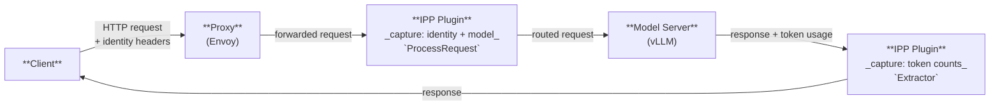

# IPP Request Attribution: Capturing Requestor, Workload & Tenant

Author(s): @simanadler

## Proposal Status

***Proposed***

## Motivation

[Phase 1 of inference cost tracking](https://github.com/opencost/opencost/blob/develop/docs/inference-cost-tracking.md) provided inference costs per model and per million tokens for the models, broken out by input and output token costs.  However, llm-d deployments need to answer additional questions the current vllm metrics do not support:

- *"What did tenant `acme-corp` spend on inference this month?"*
- *"Which workload (agent/pipeline) is driving token growth?"*
- *"Attribute this GPU bill back to the teams that consumed it."*

vLLM never sees HTTP identity headers and has no concept of tenant, workload, or requestor. The llm-d Router / Endpoint Picker (EPP) sees the
request but routes *before* the response tokens exist. IPP's existing `model-cost-extractor` produces a cost distribution *per model* based on static data from a config file. **None of these can attribute consumption to an identity.**


## Proposal

This document proposes an IPP plugin based solution to enable llm-d to generate **metrics about requestor, workload, and tenant
identity for inference requests** — the "who / what / which-tenant" needed for cost attribution,
chargeback/showback, observability, governance, and audit.

> For a survey of the broader attribution landscape (AI gateways, routing extensions, observability
> SDKs, and cost engines) and a detailed analysis of the alternatives that were considered, see
> [Appendix: Background — the attribution landscape](#appendix-background--the-attribution-landscape).

See the companion proposal (LINK!!!) describing the changes required in OpenCost to leverage the new metrics and provide tenant, workload and requestor level inference costs.

### Why IPP is the correct home

1. **It is the only component with both signals at once.** IPP sees *who* (request headers) and *how
   many tokens* (response body) in a single request cycle, carried across request→response on
   [`CycleState`][cycle_state] and the [`ResponsePayload`][datasource_types] (which already includes
   `Duration` and `TTFT`). vLLM has tokens but no identity; the EPP has identity but no response
   tokens; Envoy dynamic metadata has tokens but needs a separate mechanism to correlate identity
   headers to them. IPP already holds both.

2. **It already exists in the data plane.** This is not a new component — it is two plugins added to
   a framework built for exactly this ("any logic that benefits from reading or rewriting the body,
   headers, or trailers can be expressed as a plugin"). No new pod, no new proxy hop, no new failure
   domain, no second control plane.

3. **It respects the existing component boundaries.** IPP owns *identity + volume*, vLLM
   owns *model-level throughput*, OpenCost owns *cost monitoring*. 


## Design

### The five signal dimensions

The following are the new dimensions and their sources.

| Signal | Carrier | Field / Header | IPP access point |
|--------|---------|----------------|------------------|
| **Requestor** (who) | HTTP header | `x-user-id` (or JWT `sub`) | `request.Headers["x-user-id"]` in `ProcessRequest` |
| **Tenant** (which) | HTTP header | `x-tenant-id` | `request.Headers["x-tenant-id"]` in `ProcessRequest` |
| **Workload** (what) | HTTP header or body | `x-workload-id`, or OpenAI `user` body field | `request.Headers[...]` or `request.Body["user"]` |
| **Requested model** | JSON body | `model` | `request.Body["model"]` — captured *before* `model-selector` rewrites it |
| **Serving model** | JSON response body | `model` | `response.Body["model"]` — authoritative vLLM value; the OpenCost/vLLM join key |

> **Trust boundary (important):** header-supplied identity is only as trustworthy as whatever sets
> the headers. `x-tenant-id` / `x-user-id` / `x-workload-id` MUST be injected/validated at an
> authenticated boundary (auth proxy, gateway auth filter, or JWT verification) and MUST NOT be
> accepted verbatim from untrusted clients. This is the same caveat that applies to Envoy AI
> Gateway's `x-tenant-id` model — it is not specific to IPP.


### Two cooperating plugins



---

Following the established IPP plugin model ([`RequestProcessor`][plugins] +
data-layer [`Extractor`][datasource_types]), and mirroring the shape of the existing plugins such as the
`request-metadata-extractor` two plugins are proposed:

1. **`inference-context-extractor`** — a `RequestProcessor` that reads the five signals from the
   request and writes them to `CycleState`. **Must run first** in the profile's `request` list, ahead
   of `model-selector`, so `requested_model` captures the client's original value before the selector
   rewrites `request.Body["model"]`.

   ```go
   func (p *InferenceContextPlugin) ProcessRequest(
       _ context.Context, cycleState *plugin.CycleState, request *requesthandling.InferenceRequest,
   ) error {
       cycleState.Write(RequestorCycleStateKey, request.Headers["x-user-id"])
       cycleState.Write(TenantCycleStateKey,    request.Headers["x-tenant-id"])

       workload := request.Headers["x-workload-id"]
       if workload == "" {
           workload, _ = request.Body["user"].(string) // OpenAI convention fallback
       }
       cycleState.Write(WorkloadCycleStateKey, workload)

       requestedModel, _ := request.Body["model"].(string) // BEFORE model-selector rewrites it
       cycleState.Write(RequestedModelCycleStateKey, requestedModel)
       return nil
   }
   ```

2. **`inference-token-extractor`** — a data-layer `Extractor` that fires on `ResponseEventType`,
   reads the identity signals from `CycleState` (via [`ReadCycleStateKey[T]`][cycle_state]) and the
   token usage from `response.Body["usage"]`, increments Prometheus counters, and writes a structured
   log record. Runs asynchronously off the request hot path, exactly like the existing extractors.

   Registered under `datalayer.extractors`; it reuses the `ResponsePayload` (`Duration`, `TTFT`,
   `CycleState`, `Response`) already carried on the event.


### Requestor cardinality

`tenant` and `workload` are bounded (organizations, named pipelines) and always safe as Prometheus
labels. Because the number of requestors could potentially be very large, the decision whether to store requestor level information in prometheus is controlled by config (default on):

- **Bounded requestors** (service accounts, teams) → keep the Prometheus label
  (`prometheusRequestorLabel: true`).
- **Unbounded requestors** (individual end-users, thousands+) → disable the label to avoid
  cardinality explosion; per-requestor attribution remains only in the structured log (Tier 2).  

### Output: two tiers

- **Tier 1 — Prometheus counters** (new, `ipp_`-prefixed to match [existing metrics][metrics]):
  `ipp_inference_prompt_tokens_total`, `ipp_inference_completion_tokens_total`,
  `ipp_inference_request_total` — labeled `tenant`, `workload`, `requested_model`, `serving_model`,
  `namespace`, and conditionally `requestor`.
- **Tier 2 — Structured log**: one JSON record per request, **always** including `requestor`
  regardless of the Prometheus label setting — the authoritative record for billing/audit and for
  per-requestor attribution when the Prometheus label is disabled.


## Design Principals

- **Do not re-emit vLLM's per-model token counters from IPP.** They already exist
  (`vllm:prompt_tokens_total`, `vllm:generation_tokens_total`) and OpenCost reads them. IPP's value is
  the *identity labels* vLLM cannot carry.
- **Do not compute or store monetary cost in these plugins.** Cost monitoring belongs to OpenCost.
- **Do not emit token consumption as a gauge.** Counters survive restarts correctly via Prometheus
  reset detection.
- **Do not enable the `requestor` Prometheus label for public-facing deployments** with unbounded
  end-users without first assessing the requestor population.

## Open questions

- **Header contract & injection point.** Confirm the llm-d Proxy (Istio `EnvoyFilter` / GKE
  `GCPRoutingExtension`) forwards `x-tenant-id` / `x-user-id` / `x-workload-id` to IPP over ext-proc,
  and define where they are authenticated/injected. Without this the identity signals are absent or
  spoofable.


## References

- [Architecture](../../architecture.md) — ext-proc integration, the processing pipeline, the data layer.
- [Metrics](../../metrics.md) — existing `ipp_`-prefixed Prometheus metrics.
- [Gateway API Inference Extension](https://gateway-api-inference-extension.sigs.k8s.io) — the EPP / routing layer.
- [OpenCost Inference Cost Tracking](https://github.com/opencost/opencost/blob/develop/docs/inference-cost-tracking.md) - existing inference infrastructure level costs
- [Proposal to expand OpenCost Inference Metrics]() - LINK!!!

[cycle_state]: ../../../pkg/framework/interface/plugin/cycle_state.go
[plugins]: ../../../pkg/framework/interface/requesthandling/plugins.go
[datasource_types]: ../../../pkg/framework/interface/datalayer/datasource/types.go
[pricing]: ../../../pkg/framework/interface/datalayer/pricing/pricing.go
[cost t-digest accumulator]: ../../../pkg/framework/interface/datalayer/accumulator/cost_digest.go
[requestcostmetadata]: ../../../pkg/framework/plugins/datalayer/requestcostmetadata/README.md
[metrics]: ../../metrics.md

---

## Appendix: Background — the attribution landscape

Solutions for capturing requestor/workload/tenant metadata on inference requests cluster into three
layers. Understanding the layering is what makes the build-vs-adopt decision clear.

| Layer | Examples | Role | Identity mechanism |
|-------|----------|------|--------------------|
| **AI gateway / ext-proc** | Envoy AI Gateway, Kong/APISIX AI Gateway, LiteLLM, Portkey | Terminates traffic; captures per-request metadata + token usage | API key / virtual key → identity; `x-tenant-id` / `x-user-id` headers; request tags |
| **Routing extension** | Gateway API Inference Extension (EPP), llm-d Router | Picks the pod within a pool | None — routing only (`InferenceObjective` priority, not attribution) |
| **Observability SDK / platform** | Langfuse, Helicone, OpenLLMetry, Phoenix | Application-level tracing & cost | `user_id` / `session_id` / custom properties on spans |
| **Cost engine** | OpenCost | Joins token volume with real GPU/infra spend | Consumes labeled token metrics |

The consistent industry pattern across all of these:

> **Identity (WHO)** is bound to a credential (API key / virtual key / IAM principal). **Workload &
> tenant (WHAT / WHICH)** travel as request-body metadata, HTTP headers, or tags. Everything is
> persisted to spend logs, emitted as spans, and exported as metric labels for attribution.

Two facts from that landscape shaped this decision:

1. **The "AI gateway" attribution slot is an Envoy ext-proc filter** — the same slot IPP already
   occupies in llm-d. Envoy AI Gateway captures token usage into Envoy *dynamic metadata* via
   `LLMRequestCost` (with `InputToken`/`OutputToken`/`TotalToken`/`CEL` cost types) and rate-limits
   on `x-tenant-id` / `x-user-id` via `BackendTrafficPolicy` `clientSelectors`. IPP does the
   equivalent in Go plugins over `CycleState`.
2. **The OpenTelemetry GenAI semantic conventions have no requestor or tenant attribute.** They
   standardize `gen_ai.request.model`, `gen_ai.usage.input_tokens/output_tokens`,
   `gen_ai.conversation.id`, `gen_ai.agent.*`, and `gen_ai.workflow.name` — but define **no**
   `user.id` or `tenant.id`. Any solution (gateway or IPP) must supply identity/tenant itself, as a
   custom label or span attribute. There is no standard to "just adopt" here.

### Why not adopt an external gateway

| Candidate | Verdict for llm-d |
|-----------|-------------------|
| **Envoy AI Gateway** | Architecturally closest — same Envoy ext-proc slot. But it is a *different* control plane (Envoy Gateway + its CRDs) than the IGW/EPP + Istio/GKE stack IPP integrates with. Adopting it means a parallel gateway and re-solving the identity→token correlation its dynamic-metadata model does not natively join to headers. |
| **Kong / APISIX AI Gateway** | Strongest first-class *identity* model (Consumer objects authenticated by API key/JWT), but a general-purpose gateway outside the llm-d / IGW ecosystem; unaware of `InferencePool` / EPP disaggregated routing; token capture is per-route/consumer, not payload-aware. |
| **EPP / Gateway API Inference Extension alone** | The *routing* half only. Deliberately has no tenant/requestor/cost concept (`InferenceObjective` expresses scheduling priority, not attribution). It is IPP's complement, not a substitute — "IPP decides which pool, EPP decides which pod." |
| **Observability SDKs (Langfuse/Helicone/OTel)** | Application-layer; require instrumenting every caller. Useful *downstream* consumers of IPP's output, not a replacement for gateway-layer capture. |

### The one capability a gateway offers that this proposal does not

Envoy AI Gateway and APISIX both offer **enforcement** — hard per-tenant token budgets / rate limits
(e.g. `x-tenant-id` distinct rate-limit buckets). This proposal is **attribution only**: metrics,
logs, and an OpenCost join — it never rejects or throttles a request. If hard per-tenant quota
enforcement is later required, IPP can supply it too, since as an ext-proc it can reject or rewrite a
request. That would be a future plugin (e.g. `inference-budget-enforcer`) reading the *same*
`CycleState` identity signals this proposal establishes — not a reason to adopt a second gateway.
